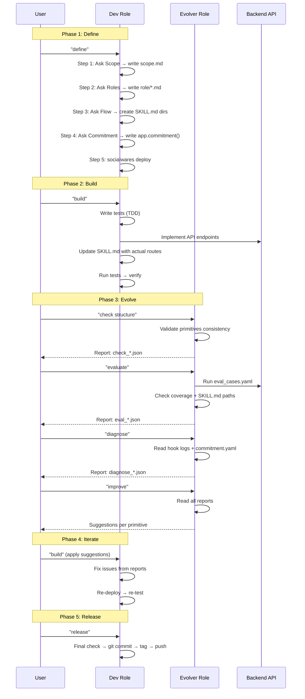

# Built-in Roles: Dev and Evolver

## Overview

The default template provides three roles:

| Role | Purpose | Skills |
|------|---------|--------|
| `default` | Business logic | `check_health` (user-defined skills) |
| `dev` | App development | `inspect`, `setup_claude`, `dev_define`, `dev_build`, `dev_release` |
| `evolver` | Quality analysis | `inspect`, `evolve_structure_check`, `evolve_api_check`, `evolve_session_diagnose`, `evolve_improve`, `evolve_auto` |

All three are ordinary roles — the compiler treats them identically. `dev` and `evolver` skills are **built into the framework** and symlinked at deploy time; they update automatically when you upgrade the framework.

---

## Dev Role

The dev role guides the full App development lifecycle: define → build → release.

### dev_define — Define the Four Primitives

Interactive step-by-step guidance for first-time App definition:

1. **Scope** — "What does this App do?" → writes `agent/scope/scope.md`
2. **Role** — "Who uses it?" → writes `agent/role/*.md`, registers in `socialware.py`
3. **Flow** — "What actions?" → creates `agent/flow/*/SKILL.md`, registers actions
4. **Commitment** — "What standards?" → adds `app.commitment(...)` to `socialware.py`
5. **Deploy** — compiles and validates

Each step waits for user confirmation before proceeding. The Agent strictly follows the template structure (Capabilities + Boundaries for scope, SKILL.md + scripts/ + references/ for skills).

### dev_build — Implement the App (TDD)

Guided development after define:

1. Read evolve reports (if any) to prioritize work
2. Write tests first, then implement backend API endpoints
3. Update SKILL.md to match actual API routes
4. Run tests, verify consistency between SKILL.md and `src/api.py`

### dev_release — Ship It

Guided release workflow:

1. Final structure check
2. Git commit with changelog
3. Tag and push

### inspect — View Compiled State

Read-only inspection of `.runtime/` contents: SOUL.md, skills, flow.yaml, commitment.yaml.

### setup_claude — Configure Claude Code

Set up Claude Code plugins, permissions, and hooks for the project.

### Customizing Built-in Skills: `socialwares eject`

Built-in skills are read-only (they live in the framework package). To customize one:

```bash
# Copy the built-in skill to your project
socialwares eject evolve_structure_check

# Now edit it freely
vim agent/flow/evolve_structure_check/SKILL.md

# Deploy uses your local version (framework version is ignored)
socialwares deploy
```

After ejecting, the skill is fully under your control — framework upgrades will not overwrite it. To revert to the framework version, delete the directory and redeploy.

---

## Evolver Role

The evolver analyzes App quality through five checks, using hook data and compilation artifacts.

### How Data Flows

```
Agent interaction → hooks (log_prompt.py, log_tool.py)
                       ↓
              .runtime/data/prompts/{session_id}.jsonl
                       ↓
              diagnose.py reads logs + commitment.yaml
                       ↓
              .runtime/data/evolve/reports/
                       ↓
              improve reads reports → suggestions
```

### evolve_structure_check — Primitive Consistency

Validates:
- Every registered action has a SKILL.md
- Every role has at least one action
- Flow graph is valid (states reachable, no isolated nodes)
- Commitment references valid roles and actions

Script: `scripts/check_structure.py`
Report: `.runtime/data/evolve/reports/check_*.json`

### evolve_api_check — API Evaluation

Runs test cases from `eval_cases.yaml` against the live backend:
- HTTP requests with expected status codes and body matching
- Coverage analysis: checks which actions have eval cases
- SKILL.md API path consistency: extracts API paths from SKILL.md files, tests against backend for 404s

Script: `scripts/run_eval.py --cases eval_cases.yaml`
Report: `.runtime/data/evolve/reports/eval_*.json`

The `--base-url` defaults to `http://localhost:{APP_PORT}` (reads `APP_PORT` env var, default 8001).

### evolve_session_diagnose — Conversation Analysis

Reads hook logs and commitment.yaml to:
- Match logged events to commitment actions
- Compute fulfillment rates per commitment
- Identify violations and patterns

Script: `scripts/diagnose.py`
Report: `.runtime/data/evolve/reports/diagnose_*.json`

### evolve_improve — Suggest Improvements

Reads all reports (check, eval, diagnose) and generates actionable improvement suggestions targeting specific primitives (scope, role, flow, or commitment).

### evolve_auto — Automated Test Suite

Runs conversation-level tests: sends prompts, checks Agent skill selection, and validates response content (`expected_contains`, `expected_not_contains`).

Script: `scripts/run_auto.py`
Report: `.runtime/data/evolve/reports/auto_*.json`

---

## Maximizing Automation: The Full Dev-Evolve Cycle

### Automated Workflow

Launch dev and evolver together in tmux:

```bash
socialwares start --role dev,evolver
```

Then execute the full cycle within the dev role:

```
define → deploy → build → check → evaluate → diagnose → improve → build → release
```

### Sequence Diagram



### Quick Reference

| Action | Role | Trigger Command | What It Does |
|--------|------|----------------|-------------|
| Define primitives | dev | `"define"` | Step-by-step four primitive definition |
| Build app | dev | `"build"` | TDD: tests → API → SKILL.md → verify |
| Check structure | evolver | `"check structure"` | Validate primitive consistency |
| Evaluate API | evolver | `"evaluate"` | Run eval cases + coverage + path check |
| Diagnose sessions | evolver | `"diagnose"` | Analyze hook logs vs commitments |
| Suggest improvements | evolver | `"improve"` | Actionable suggestions from reports |
| Run auto tests | evolver | `"auto test"` | Conversation-level test suite |
| Inspect state | dev | `"inspect"` | View compiled .runtime/ contents |
| Setup Claude | dev | `"setup claude"` | Configure Claude Code for project |
| Release | dev | `"release"` | Git commit, tag, push |

---

## Hook System

Hooks capture conversation data for the evolver to analyze.

### How Hooks Work

The compiler generates two Python hook scripts per role:
- `log_prompt.py` — triggered on `UserPromptSubmit` (captures user messages)
- `log_tool.py` — triggered on `PreToolUse` (captures tool calls)

Both are executed via `uv run --no-project python <script_path>`.

### Data Storage

```
.runtime/data/prompts/
├── {session_id}.jsonl    ← per-session log (when session_id available)
└── current.jsonl         ← fallback (when no session_id)
```

Each line is a JSON object with: `timestamp`, `type`, `role`, `content`, `session_id`.

### Hook Registration

Hooks are registered in the adapter-specific config:
- **Claude**: `.claude/hooks/` directory + `settings.local.json`
- **Codex**: `.codex/hooks.json` + `.codex/config.toml`
- **Kimi**: no hook support

---

## Adding Custom Evolve Checks

The evolver is extensible. Add your own checks:

```bash
# 1. Create the skill directory
mkdir -p agent/flow/evolve_my_check/{scripts,references}

# 2. Write SKILL.md with instructions
cat > agent/flow/evolve_my_check/SKILL.md << 'EOF'
# evolve_my_check

## Trigger
User says "my check" or "custom check"

## Steps
1. Run `scripts/my_check.py`
2. Read output and present findings
EOF

# 3. Register in socialware.py
# app.action("evolve_my_check", role=["evolver"])

# 4. Deploy
socialwares deploy
```
