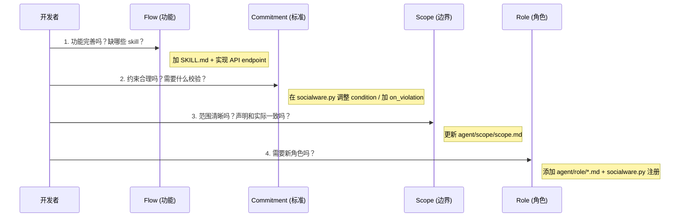
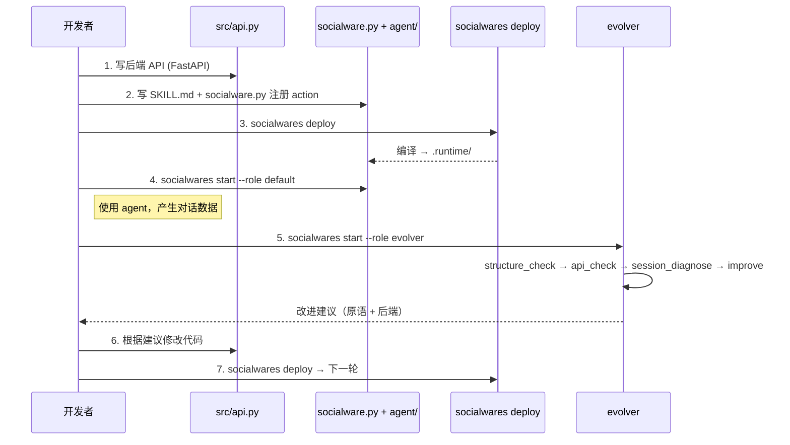
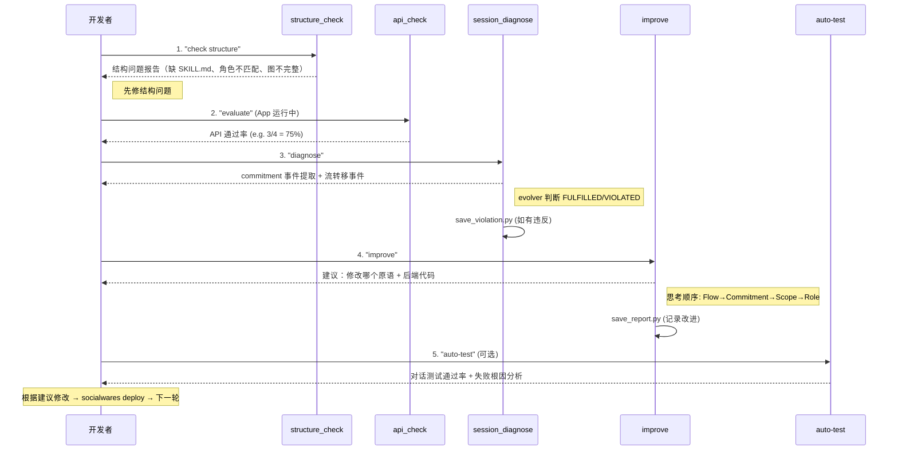

# 开发指南

## 1. 整体机制

### 框架 → 项目 → Runtime

```
pip install socialwares (框架 pip 包)
  │
  │  socialwares new task-review
  ▼
task-review/ (用户项目)
  │
  ├── socialware.py   ← 关系定义（action→role, 状态机, commitment）
  ├── agent/          ← 内容文件（role/*.md, scope/scope.md, flow/*/SKILL.md）
  ├── src/api.py      ← FastAPI 后端
  ├── app/            ← 前端 UI
  └── pyproject.toml  ← 项目配置 [tool.socialwares]
        │
        │  socialwares deploy
        ▼
.runtime/ (Runtime，编译产物)
  ├── agents/{role}/  ← 每个角色的 SOUL.md + skills symlinks + hooks
  ├── flow.yaml       ← 从 socialware.py 生成
  ├── commitment.yaml ← 从 socialware.py 生成
  └── data/           ← prompts/ sessions/ evolve/
```

### 开发自己的软件

1. `socialwares new my-app` 创建项目
2. 在 `agent/` 下写内容文件（role、scope、flow SKILL.md）
3. 在 `socialware.py` 定义关系（action→role 映射、状态机、commitment）
4. 在 `src/` 下写后端代码（FastAPI endpoints）
5. `socialwares deploy` 编译 → `socialwares start --role default` 启动 agent

### 升级框架

```bash
pip install --upgrade socialwares
```

框架升级不影响用户项目内容（`socialware.py`、`agent/`、`src/` 都属于用户）。

---

## 2. 渐进式开发流程

### 四原语

| 原语 | 定义位置 | 内容位置 | 回答什么 | 对应软件层 |
|------|---------|---------|---------|-----------|
| **Role** | `socialware.py` `app.role(...)` | `agent/role/*.md` | 谁？ | 前端：用户角色/权限；后端：RBAC |
| **Scope** | `socialware.py` `app.scope(...)` | `agent/scope/scope.md` | 在哪里？ | 前端：功能边界/UI 可见性；后端：API 范围 |
| **Commitment** | `socialware.py` `app.commitment(...)` | 无（编译为 .runtime/commitment.yaml） | 什么标准？ | 前端：约束提示；后端：校验逻辑 |
| **Flow** | `socialware.py` `app.action(...)` / `app.flow(...)` | `agent/flow/*/SKILL.md` | 怎么做？ | 前端：页面/交互流程；后端：API endpoints + 状态机 |

### 为什么四原语映射到前后端

```
四原语（DSL）             Agent 行为           软件实现
─────────────            ──────────           ────────
Role    ──────────→   SOUL.md 角色身份     → RBAC + 权限 API
Scope   ──────────→   SOUL.md 能力边界     → API scope + UI 可见性
Flow    ──────────→   SKILL.md 操作指引    → API endpoints + 状态机
Commitment ───────→   评估标准（仅 evolver 可见）→ 校验逻辑
```

四原语分为两个层面：
- **关系定义** 在 `socialware.py`（声明式 Python API）
- **内容定义** 在 `agent/` 下的文件

`socialwares deploy` 将两者编译为 `.runtime/`（agent 看到的指令）。agent 通过 SKILL.md 知道"怎么调用 API"，所以每个 SKILL.md 对应一个后端 endpoint。

### 进化顺序：Flow → Commitment → Scope → Role



**Commitment 的核心作用**：它是四原语之间的"质量胶水"。Commitment 不强制执行，而是定义评估标准——evolver 读取 `.runtime/commitment.yaml`，对比实际行为数据，判断是否达标，然后反推应该改进哪个原语。

### 一般开发流程



---

## 3. Evolver 的作用

Evolver 是普通角色，与业务角色使用完全相同的 skill 结构和编译逻辑。

### 命令一览

| 命令 | Skill | 做什么 | 需要 App 运行？ |
|------|-------|--------|---------------|
| `"check structure"` | `evolve_structure_check` | 检查四原语结构一致性 + 流图完整性 | 否 |
| `"evaluate"` | `evolve_api_check` | 运行 eval_cases.yaml HTTP 测试 | 是 |
| `"diagnose"` | `evolve_session_diagnose` | 从对话日志提取 commitment 事件 + 流转移事件 | 否 |
| `"improve"` | `evolve_improve` | 基于证据提出改进建议 + 应用修改 | 否 |
| `"auto-test"` | `evolve_auto` | 通过 SDK 运行对话测试用例 | 是 |

### 需要提供的文件

| 文件 | 用途 | 自动化测试 |
|------|------|-----------|
| `agent/flow/evolve_api_check/eval_cases.yaml` | HTTP API 测试用例 | `run_eval.py` |
| `agent/flow/evolve_auto/conversation_tests/*.yaml` | 对话测试用例（expected_skill + expected_contains + expected_not_contains） | `run_auto.py` |
| `socialware.py` 中的 `app.commitment(...)` | 评估标准 | `diagnose.py` 提取事件，evolver 判断 |

### Evolver 生命周期



### 收到 improve 建议后的开发流程


**关键原则**：
- 每次只改一个原语，测量改进效果后再改下一个
- 原语改动通常伴随后端代码改动（SKILL.md 加了新操作 → 后端要有对应 API）
- 用 eval_cases.yaml 和 conversation_tests 固化测试，防止回归
- `save_report.py` 记录每次改进，形成审计轨迹
- 关系定义（action→role, 状态机, commitment）在 `socialware.py`，内容定义在 `agent/` 文件
