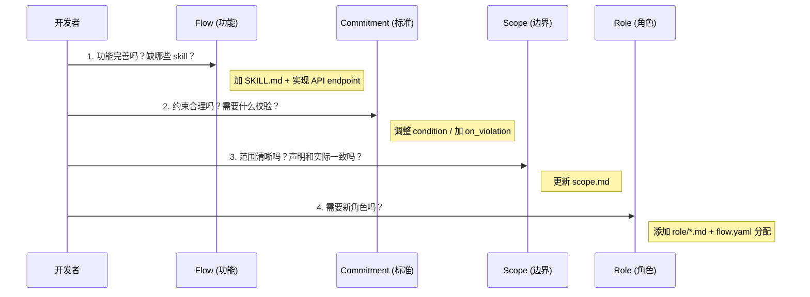
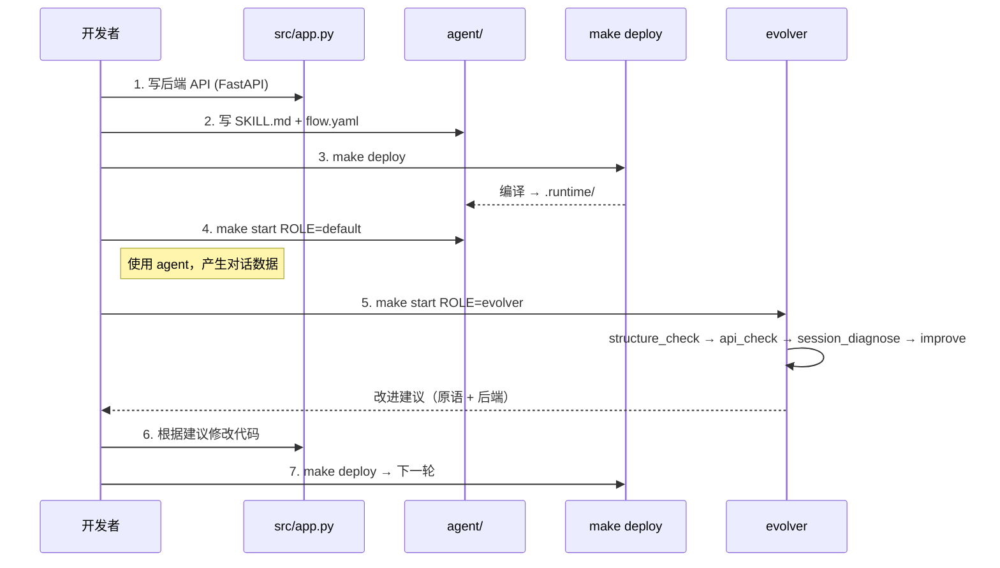
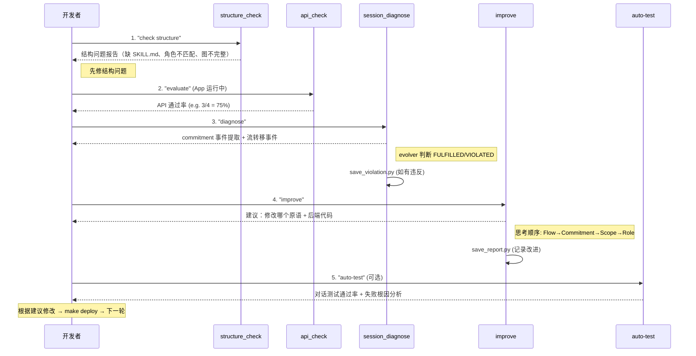
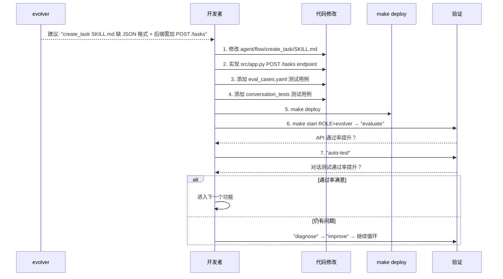

# 开发指南

## 1. 整体机制

### 模板 → Workspace → Runtime

```
Socialwares (模板仓库)
  │
  ├── agent/          ← 四原语定义 + 适配器 + 部署脚本
  ├── src/            ← 应用模板代码
  └── scripts/        ← create-my-socialware.py
        │
        │  make create ROOM=team APP=myapp
        ▼
.socialware/workspace/team/myapp/ (Workspace)
  │
  ├── agent/          ← 四原语（从模板复制，可自定义）
  ├── src/            ← 应用代码（从模板复制，自行开发）
  ├── Makefile        ← 从 Makefile.template 复制
  └── pyproject.toml  ← 独立 Python 环境
        │
        │  make deploy
        ▼
.runtime/ (Runtime，编译产物)
  ├── agents/{role}/  ← 每个角色的 SOUL.md + skills symlinks + hooks
  └── data/           ← prompts/ sessions/ evolve/
```

### 开发自己的软件

1. `make create` 创建 workspace
2. 在 `src/` 下写后端代码（FastAPI endpoints）
3. 在 `agent/flow/` 下写 SKILL.md（agent 怎么调用你的 API）
4. 在 `agent/flow/flow.yaml` 注册 action + 分配 role
5. `make deploy` 编译 → `make start` 启动 agent

### 改进模板

1. 在模板根目录修改 `agent/` 下的脚本、适配器、部署逻辑
2. workspace 通过 `make sync` 同步模板的基础设施（脚本、适配器、Makefile）
3. SKILL.md 和 references/ 是用户可自定义的，sync 不覆盖

---

## 2. 渐进式开发流程

### 四原语

| 原语 | 目录 | 回答什么 | 对应软件层 |
|------|------|---------|-----------|
| **Role** | `agent/role/*.md` | 谁？ | 前端：用户角色/权限；后端：RBAC |
| **Scope** | `agent/scope/scope.md` | 在哪里？ | 前端：功能边界/UI 可见性；后端：API 范围 |
| **Commitment** | `agent/commitment/commitment.yaml` | 什么标准？ | 前端：约束提示；后端：校验逻辑 |
| **Flow** | `agent/flow/flow.yaml` + `SKILL.md` | 怎么做？ | 前端：页面/交互流程；后端：API endpoints + 状态机 |

### 为什么四原语映射到前后端

```
四原语（DSL）        Agent 行为          软件实现
─────────────        ──────────          ────────
Role    ─────────→   SOUL.md 角色身份  → RBAC + 权限 API
Scope   ─────────→   SOUL.md 能力边界  → API scope + UI 可见性
Flow    ─────────→   SKILL.md 操作指引  → API endpoints + 状态机
Commitment ──────→   评估标准（仅 evolver 可见）→ 校验逻辑
```

四原语是 agent 的 DSL（声明式语言），deploy 编译为 SOUL.md（agent 看到的指令）。agent 通过 SKILL.md 知道"怎么调用 API"，所以每个 SKILL.md 对应一个后端 endpoint。

### 进化顺序：Flow → Commitment → Scope → Role



**Commitment 的核心作用**：它是四原语之间的"质量胶水"。Commitment 不强制执行，而是定义评估标准——evolver 读取 commitment.yaml，对比实际行为数据，判断是否达标，然后反推应该改进哪个原语。

### 一般开发流程



---

## 3. Evolver 的作用

### 命令一览

| 命令 | Skill | 做什么 | 需要 App 运行？ |
|------|-------|--------|---------------|
| `"check structure"` | `evolve_structure_check` | 检查四原语结构一致性 + 流图完整性 | 否 |
| `"evaluate"` | `evolve_api_check` | 运行 eval_cases.yaml HTTP 测试 | 是 |
| `"diagnose"` | `evolve_session_diagnose` | 从对话日志提取 commitment 事件 + 流转移事件 | 否 |
| `"improve"` | `evolve_improve` | 基于证据提出改进建议 + 应用修改 | 否 |
| `"auto-test"` | `evolve_auto` | 通过 SDK 运行对话测试用例 | 是 |

### 需要提供的文件

| 文件 | 用途 | 自动化测试 |
|------|------|-----------|
| `agent/flow/evolve_api_check/eval_cases.yaml` | HTTP API 测试用例 | `run_eval.py` |
| `agent/flow/evolve_auto/conversation_tests/*.yaml` | 对话测试用例（expected_skill + expected_contains + expected_not_contains） | `run_auto.py` |
| `agent/commitment/commitment.yaml` | 评估标准 | `diagnose.py` 提取事件，evolver 判断 |

### Evolver 生命周期



### 收到 improve 建议后的开发流程



**关键原则**：
- 每次只改一个原语，测量改进效果后再改下一个
- 原语改动通常伴随后端代码改动（SKILL.md 加了新操作 → 后端要有对应 API）
- 用 eval_cases.yaml 和 conversation_tests 固化测试，防止回归
- `save_report.py` 记录每次改进，形成审计轨迹
